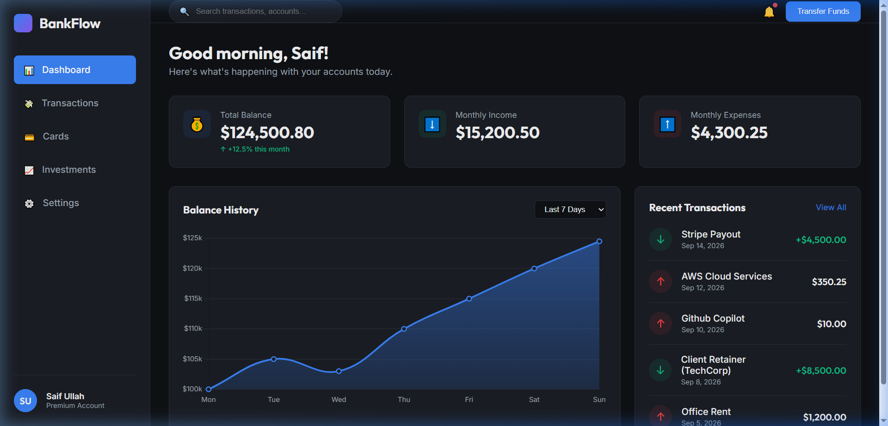

# BankFlow API — Digital Banking Backend

A production-ready ASP.NET Core 8 Web API demonstrating clean architecture, RESTful design, Entity Framework Core, and mock third-party integration (Stripe) for a digital banking SPA.

## Features

- **Architecture**: N-Tier structure (Controllers, Services, Models, Data).
- **Database**: Entity Framework Core with SQLite. Database is automatically seeded on startup for easy testing.
- **Payment Processing**: Simulated Stripe payment service integration.
- **API Documentation**: Swagger / OpenAPI integrated.
- **Testing**: xUnit test project for business logic validation.
- **UI**: Embedded static dashboard UI inside `wwwroot`.

## Getting Started

### Prerequisites
- .NET 8 SDK

### Run the API
1. Clone the repository
2. Navigate to the project directory
3. Run the application:
   ```bash
   dotnet run
   ```
4. Access the API Documentation: `http://localhost:<port>/swagger`
5. Access the Dashboard: `http://localhost:<port>/index.html`

## Architecture Highlights
- `PortfolioController`: Exposes real-time account summary and mock chart data.
- `TransactionsController`: Exposes transaction history and handles mock Stripe charges.
- `TransactionService`: Handles the business logic of debiting/crediting accounts cleanly.
- `BankFlowDbContext`: EF Core context utilizing SQLite.
